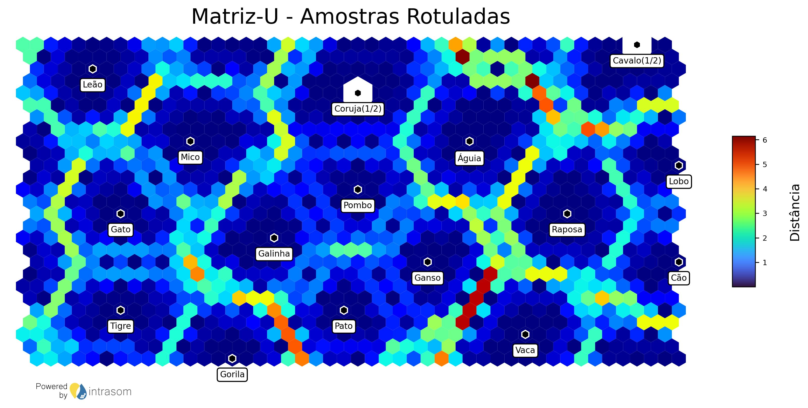

<div style="text-align: center; padding: 20px;">
  
</div>

# IntraSOM
-----
Intrasom é uma implementação completamente baseada em Python de mapas auto-organizáveis (SOMs) desenvolvido 
pelo centro de pesquisas Integrated Technology for Rock and Fluid Analysis (InTRA) (https://www.usp.br/intra/). 
IntraSOM é construído usando Programação Orientada a Objetos e inclui suporte para grades hexagonais, 
topologias toroidais e uma ampla gama de ferramentas de visualização para melhorar a análise, exploração 
e classificação de conjuntos de dados complexos. Além disso, IntraSOM inclui recursos para lidar com 
dados ausentes durante o treinamento e para algoritmos eficientes de agrupamento. Essa biblioteca tem como 
objetivo tornar os SOMs mais acessíveis a pesquisadores e profissionais em diversos campos, fornecendo 
uma implementação Python abrangente de SOMs e um framework para expandir e implementar facilmente outros 
algoritmos baseados em SOM.

-----

## Framework
<div style="text-align: center; padding: 20px;">
  
</div>

-----
## Um pacote de visualização
<div style="flex: 1; text-align: center; padding: 10px;">
  <h3>Matriz U</h3>
  
</div>

<div style="flex: 1; text-align: center; padding: 10px;">
  <h3>Matriz U com Rótulos de Amostras</h3>
  
</div>

<div style="flex: 1; text-align: center; padding: 10px;">
  <h3>Matriz U com Template de Neurônios</h3>
  
</div>

<div style="flex: 1; text-align: center; padding: 10px;">
  <h3>Mapa de Componentes</h3>
  
</div>

<div style="flex: 1; text-align: center; padding: 10px;">
  <h3>Agrupamentos</h3>
  
</div>

<div style="flex: 1; text-align: center; padding: 10px;">
  <h3>Fusão de Agrupamentos</h3>
  
</div>

<div style="flex: 1; text-align: center; padding: 10px;">
  <h3>Agrupamentos com Template de Neurônios</h3>
  
</div>


-----

## Estrutura

A estrutura dessa biblioteca é baseada na estrutrua da biblioteca SOMPY de Moosavi et al (2014). Com implementação de:
* Treinamento em topologia toroidal
* Treinamento em célula hexagonal
* Treinamento com dados faltantes
* Imputação de dados
* Carregamento de um treinamento performado anteriormente.
* Módulo de avaliação do treinamento semi-supervisionado com plotagem de curva ROC.
* Módulo de Plotagem e calculo de matriz U e mapa de componentes de treinamento.
* Salvamento dos dados treinamento.
* Geração de Relatório de Treinamento.
* Projeção de novos dados em um mapa treinado.
* Módulo de agrupamento dos neurônios treinados com k-means e vizualização dos resultados.
* Calculo da matriz de distâncias acelerado
* Formato parquet para entrada e saida de dados e resultados do treinamento
* Plotagem de rótulos na Matriz-U
* Implementação da análise de amostras representativas e sua visualização na Matriz-U
-----
## Documentação e Exemplos
Para exemplos de utilização documentada das funções e funcionalidades dessa biblioteca acesse o Jupyter Notebook:
[IntraSOM: Documentação Exemplificada](exemplos/exemplos_doc.ipynb)<br>
<div style="flex: 1; text-align: center; padding: 10px;">
  <h3>Documentação Exemplificada em Jupyter Notebook</h3>
  
</div>
Obs: Esse notebook não é carregado via GitHub devido ao tamanho, mas pode ser acessado por qualquer IDE com suporte para Jupyter Notebooks.

-----

## Acesso aos Docstrings das Funções
Todas as funções da biblioteca IntraSOM tem a documentação dos parâmetros de entrada e saída no formato de Docstrings que podem ser acessados com a função help(...) do Python. <br>
Exemplo:
```
>>> help(som_test.train)

    Método de classe para treinamento do objeto SOM.
    
    Args:
        n_job: número de trabalhos para usar e paralelizar o treinamento.
    
        shared_memory: bandeira para ativar a memória compartilhada.
    
        train_rough_len: Numero de iterações durante o treinamento bruto.
    
        train_rough_radiusin: Raio inicial de busca de BMUs durante o
            treinamento bruto.
    
        train_rough_radiusfin: Raio final de busca de BMUs durante o
            treinamento bruto.
    
        train_finetune_len: Número de iterações durante o treinamento fino.
    
        train_finetune_radiusin: Raio inicial de busca de BMUs durante o
            treinamento fino.
    
        train_finetune_radiusfin: Raio final de busca de BMUs durante o
            treinamento fino.
    
        train_len_factor: Fator que multiplica os valores de extensão do
            treinamento (rought, fine, etc)
    
        maxtrainlen: Valor máximo de interações desejado.
            Default: np.Inf (infinito).
    
    Retorna:
        Objeto som treinado segundo os parâmetros escolhidos.
```

-----
## Dependências

As dependências do pacote IntraSOM são:
| Pacote         | Versão    |
| -------------- | --------- |
| matplotlib     | 3.7.1     |
| scipy          | 1.10.1    |
| joblib         | 1.2.0     |
| scikit-learn   | 1.2.2     |
| pandas         | 2.0.1     |
| tqdm           | 4.65.0    |
| plotly         | 5.14.1    |
| scikit-image   | 0.20.0    |
| pyarrow        | 9.0.0     |
| openpyxl       | 3.1.2     |
| geopandas      | 0.13.0    |
| shapely        | 2.0.1     |
| ipywidgets     | 8.0.6     |


-----

## Instalação

### Barra de Progresso
Para que a barra de progresso funcione no Jupyter Notebook ou Jupyterlab:
```
pip install ipywidgets
jupyter nbextension enable --py widgetsnbextension
```

### Repositório
```
# Clonar repositório
git clone https://github.com/InTRA-USP/IntraSOM.git

# Acessar pasta
cd IntraSOM

# Instalar setup.py
pip install setup.py
```
### Pip
```
pip install intrasom
```
-----

## Citação
Em breve...

-----

## Autores
| [<br><sub>InTRA</sub >](https://github.com/InTRA-USP) | [<br><sub>Rodrigo Gouvêa</sub>](https://github.com/rodiegeology) |  [<br><sub>Cleyton Carneiro</sub>](https://github.com/cleytoncarneiro) |  [<br><sub>Rafael Gioria</sub>](https://github.com/rafaelgioria) |  [<br><sub>Gustavo Rodovalho</sub>](https://github.com/GustavoRodovalho) |
| :---: | :---: | :---: | :---: | :---: |

-----
## Agradecimentos
|<br>USP|<br>PMI|<br>PPGEMin|<br>LCT - USP|<br>IGCe - USP|<br>ICMC - USP|<br>CeMEAI - USP|
| :---: | :---: | :---: | :---: | :---: | :---: | :---: |

<br>

Agradecimentos a pessoas que direta ou indiretamente contribuiram para o desenvolvimento desta biblioteca:

<br>

|Contribuidor|Instituição|
| -------------- | --------- |
| Stephen Fraser | VectORE Pty Ltd|
|Michel J Friedel|University of Colorado/Univeristy of Hawaii|
|Carina Ulsen|PMI/InTRA/LCT - USP|
|Jean Ferrari|PMI/Intra - USP|
|Michele Kuroda|Cepetro - Unicamp|
|Guilherme Barreto|Universidade Federal do Ceará|
|Afonso Paiva Neto|ICMC - USP|
|Cibele Russo|ICMC - USP|

-----

## Licença

<a rel="license" href="http://creativecommons.org/licenses/by-nc/4.0/"></a><br />This work is licensed under a <a rel="license" href="http://creativecommons.org/licenses/by-nc/4.0/">Creative Commons Attribution-NonCommercial 4.0 International License</a>.

<div style="text-align: left;">
  
</div>

