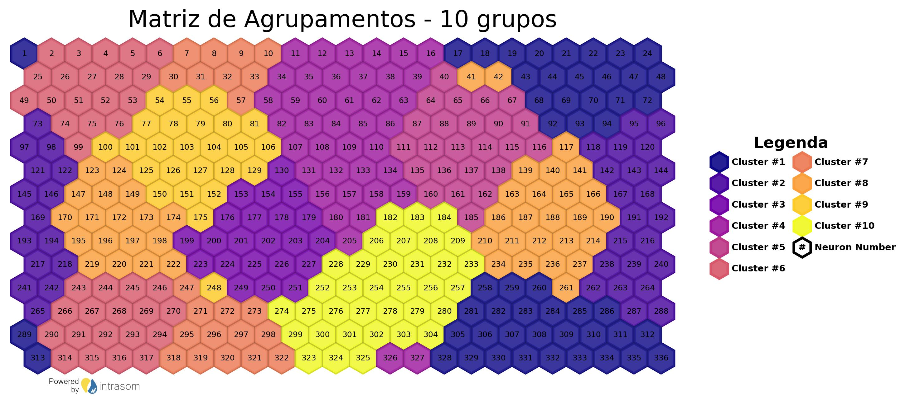

<div style="text-align: center; padding: 20px;">
  
</div>

# IntraSOM
-----
<p style="text-align: justify; text-indent: 1.5cm;">
IntraSOM is a fully Python-based implementation of self-organizing maps (SOM) developed by the Integrated Technology for Rock and Fluid Analysis (InTRA) research center (https://www.usp.br/intra/). IntraSOM is built using Object-Oriented Programming and includes support for hexagonal grids, toroidal topologies, and a wide range of visualization tools to enhance the analysis, exploration, and classification of complex datasets. Furthermore, IntraSOM includes features for handling missing data during training and efficient clustering algorithms. This library aims to make Self-Organizing techniques more accessible to researchers and professionals in various fields by providing a comprehensive Python implementation of SOM and a framework for easily expanding and implementing other SOM-based algorithms.
</p>
-----

## Framework
<div style="text-align: center; padding: 20px;">
  
</div>

-----
## An visualization library
<div style="flex: 1; text-align: center; padding: 10px;">
  <h3>U-Matrix</h3>
  
</div>

<div style="flex: 1; text-align: center; padding: 10px;">
  <h3>U-Matrix with Samples Label</h3>
  
</div>

<div style="flex: 1; text-align: center; padding: 10px;">
  <h3>U-Matrix with Watermark Neuron Template</h3>
  
</div>

<div style="flex: 1; text-align: center; padding: 10px;">
  <h3>Component Plots</h3>
  
</div>

<div style="flex: 1; text-align: center; padding: 10px;">
  <h3>Clustering</h3>
  
</div>

<div style="flex: 1; text-align: center; padding: 10px;">
  <h3>Clustering with Merged Visualization</h3>
  
</div>

<div style="flex: 1; text-align: center; padding: 10px;">
  <h3>Clustering with Neuron Template</h3>
  
</div>


-----

## Structure

The structure of this library is based on the structure of the SOMPY library by Moosavi et al. (2014), with implementations of:

* Training projected toroidal topology
* Training on hexagonal lattice
* Training with missing data
* Data imputation
* Loading a previously performed training
* Module for evaluating semi-supervised training with ROC curve plotting
* Module for plotting and calculating the U-matrix and component maps of the training
* Saving training data
* Generation of Training Report
* Projection of new data onto a trained map
* Clustering module for trained neurons using k-means and visualization of the results
* Accelerated distance matrix calculation
* Parquet format for input and output of data and training results
* Label plotting on the U-matrix
* Implementation of representative sample analysis and visualization on the U-matrix
-----
## Documentation and Examples
For documented examples of usage of the functions and features of this library, please refer to the Jupyter Notebook:
[IntraSOM: Documented Examples](exemplos/exemplos_doc.ipynb)<br>
<div style="flex: 1; text-align: center; padding: 10px;">
  <h3>Documented Examples in Jupyter Notebook</h3>
  
</div>

**Note**: This notebook is not loaded via GitHub due to its size, but it can be accessed through any IDE that supports Jupyter Notebooks.

-----

## Access to Methods Docstrings
All functions in the IntraSOM library have documentation for input and output parameters in the form of Docstrings, which can be accessed using the Python *help(...)* built-in function.<br>

Example:
```
>>> help(som_test.train)
Help on method train in module intrasom.intrasom:

train(bootstrap=False, bootstrap_proportion=0.8, n_job=-1, save=True, summary=True, dtypes='parquet', shared_memory=False, train_rough_len=None, train_rough_radiusin=None, train_rough_radiusfin=None, train_finetune_len=None, train_finetune_radiusin=None, train_finetune_radiusfin=None, train_len_factor=1, maxtrainlen=1000, history_plot=False, previous_epoch=False) method of intrasom.intrasom.SOM instance
    Class method for training the SOM object.
    
    Args:
        n_job: number of jobs to use and parallelize training.
    
        shared_memory: flag to enable shared memory.
    
        train_rough_len: number of iterations during rough training.
    
        train_rough_radiusin: initial BMU fetching radius during
            rough training.
    
        train_rough_radiusfin: BMU search final radius during
            rough training.
    
        train_finetune_len: number of iterations during fine training.
    
        train_finetune_radiusin: initial BMU scan radius during
            fine training.
    
        train_finetune_radiusfin: BMU search final radius during
            fine training.
    
        train_len_factor: factor that multiplies the values ​​of the training
            extension (rough, fine, etc)
    
        maxtrainlen: maximum value of desired interactions.
            Default: np.Inf (infinity).
    
    Returns:
        SOM object trained according to the chosen parameters.
```

-----
## Dependencies

The IntraSOM dependencies are:
| Library        | Version    |
| -------------- | --------- |
| matplotlib     | 3.7.1     |
| scipy          | 1.10.1    |
| joblib         | 1.2.0     |
| scikit-learn   | 1.2.2     |
| pandas         | 2.0.1     |
| tqdm           | 4.65.0    |
| plotly         | 5.14.1    |
| scikit-image   | 0.20.0    |
| pyarrow        | 9.0.0     |
| openpyxl       | 3.1.2     |
| geopandas      | 0.13.0    |
| shapely        | 2.0.1     |
| ipywidgets     | 8.0.6     |


-----

## Instalation

### Progress Bar
For the progress bar to work in Jupyter Notebook or JupyterLab:
```
pip install ipywidgets
jupyter nbextension enable --py widgetsnbextension
```

### Repository
```
# Clone repository
git clone https://github.com/InTRA-USP/IntraSOM.git

# Access directory where IntraSOM is placed
cd IntraSOM

# Install setup.py
pip install setup.py
```
### Pip
```
pip install intrasom
```
-----

## Citation
Em breve...

-----

## Authors
| [<br><sub>InTRA</sub >](https://github.com/InTRA-USP) | [<br><sub>Rodrigo Gouvêa</sub>](https://github.com/rodiegeology) |  [<br><sub>Cleyton Carneiro</sub>](https://github.com/cleytoncarneiro) |  [<br><sub>Rafael Gioria</sub>](https://github.com/rafaelgioria) |  [<br><sub>Gustavo Rodovalho</sub>](https://github.com/GustavoRodovalho) |
| :---: | :---: | :---: | :---: | :---: |


-----
## Acknowledgments
|<br>USP|<br>PMI|<br>PPGEMin|<br>LCT - USP|<br>IGCe - USP|<br>ICMC - USP|<br>CeMEAI - USP|
| :---: | :---: | :---: | :---: | :---: | :---: | :---: |

<br>

Thanks to people who directly or indirectly contributed to the development of this library:

<br>

|Contributor|Institution|
| -------------- | --------- |
| Stephen Fraser | VectORE Pty Ltd|
|Michel J Friedel|University of Colorado/Univeristy of Hawaii|
|Carina Ulsen|PMI/InTRA/LCT - USP|
|Jean Ferrari|PMI/Intra - USP|
|Michele Kuroda|Cepetro - Unicamp|
|Guilherme Barreto|Universidade Federal do Ceará|
|Afonso Paiva Neto|ICMC - USP|
|Cibele Russo|ICMC - USP|

-----

## License

<a rel="license" href="http://creativecommons.org/licenses/by-nc/4.0/"></a><br />This work is licensed under a <a rel="license" href="http://creativecommons.org/licenses/by-nc/4.0/">Creative Commons Attribution-NonCommercial 4.0 International License</a>.

<div style="text-align: left;">
  
</div>

